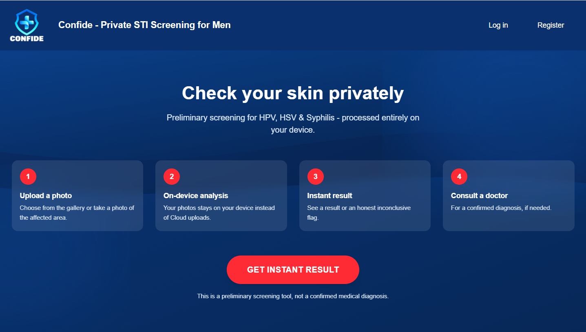
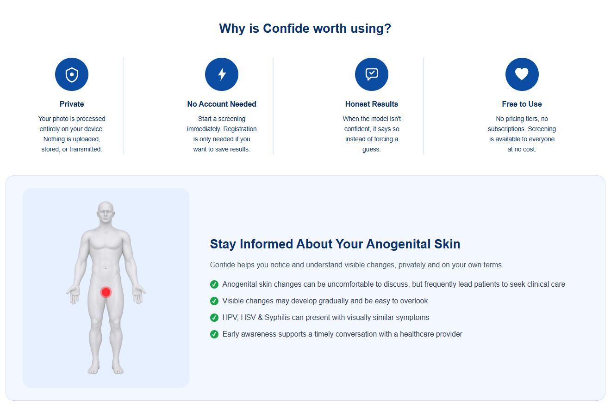
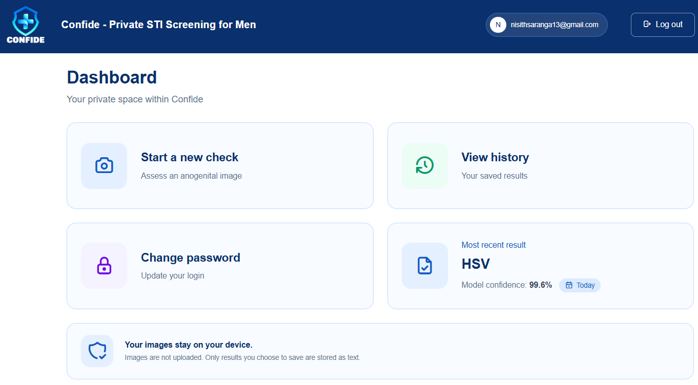

<div align="center">

#  Confide

**Privacy-preserving, on-device visual screening for HPV, HSV, and syphilis.**


**Current release: `v0.3.0`** — final academic project implementation

</div>

Confide is a web application that classifies photographs of common male anogenital STI presentations entirely on the user's own device. No submitted image is ever transmitted to, or stored on, any server. This is not a policy promise; it is a structural property of the architecture, and it is demonstrable: disconnect the backend entirely, and classification still works.

> Final-year BSc (Hons) Software Engineering project, Cardiff Metropolitan University.

---

## Screenshots

## Screenshots

<table>
  <tr>
    <td colspan="2"></td>
  </tr>
  <tr>
    <td></td>
    <td></td>
  </tr>
</table>

---

## Why on-device?

Automated visual screening of STI-related presentations has been explored previously, but the reviewed literature did not combine multiclass STI-specific image classification with privacy-preserving, on-device deployment. Existing accessible symptom-assessment tools also rely largely on self-reported information rather than direct visual assessment.

Confide addresses this gap by converting the trained classification models into a form that runs directly inside the browser. The image is analysed where it already is: on the user's device. The server never receives or stores the submitted image.

---

## How it works

1. **Frame the area** - the user captures or uploads a photo.
2. **On-device skin check** - a lightweight MobileNetV2 classifier confirms the image plausibly shows skin before anything further happens. Non-skin images are rejected immediately, without ever reaching the classification model.
3. **Ensemble classification** - two independently fine-tuned ResNet50 models, differing in backbone unfreeze depth, each produce a prediction. Their outputs are averaged.
4. **Confidence-gated result** - if the ensemble confidence reaches the configured 0.60 threshold, a result is shown together with condition-specific guidance and a clear non-diagnostic disclaimer. Predictions below the threshold are reported as Inconclusive rather than being forced into one of the three target classes.

Steps 2 through 4 all occur entirely in the browser, via TensorFlow.js.

---

## Model performance

The final ensemble was evaluated on a held-out test set never used in training:

| Class | Precision | Recall | F1-score |
|---|---|---|---|
| HPV | 0.796 | 0.684 | 0.736 |
| HSV | 0.784 | 0.806 | 0.795 |
| Syphilis | 0.688 | 0.759 | 0.721 |
| **Overall accuracy** | | | **75.4%** |
| **Macro F1-score** | | | **75.06%** |

The final model was reached through a systematic, extensively documented evaluation of 20 configurations, covering architecture selection, regularisation, backbone unfreeze depth, and ensemble composition, with each turning point evidenced and analysed in the accompanying dissertation.

---

## Architecture

```
┌─────────────────────────────┐        ┌──────────────────────────┐
│         CLIENT (browser)     │        │      SERVER (FastAPI)     │
│                               │        │                            │
│  • Skin-detection model      │        │  • Account management     │
│  • Ensemble classification   │◄──────►│  • Result persistence      │
│  • All image processing      │  auth  │    (text-only, opt-in)    │
│                               │  &     │                            │
│  Images NEVER leave here     │  saves │  Never receives an image  │
└─────────────────────────────┘        └──────────────────────────┘
```

The server's role is deliberately narrow: authentication and the optional, consent-based storage of a text-only result (condition + confidence). The backend exposes no endpoint for submitted image data; its responsibilities are limited to authentication and optional text-only result persistence.

> **🩺 Privacy is structural, not promised.** Disconnect the backend entirely and classification continues to work without interruption — only authentication and saved-result features depend on it. Nothing in the pipeline was ever built with a way to send an image out.

---

## Tech stack

**Client** - Next.js, TypeScript, Tailwind CSS, TensorFlow.js
**Server** - FastAPI (Python), MongoDB (via Motor), bcrypt, JWT (python-jose)

**Design patterns applied:**
- **Dependency Injection** - FastAPI's `Depends()` centralises identity verification across every protected route
- **Singleton** - module-scoped model caching, preventing redundant multi-hundred-megabyte re-downloads during a session
- **Repository** - all database access mediated through dedicated repository classes, isolating persistence logic from route handlers

---

## Getting started

**Prerequisites:** Node.js, Python 3.11, a MongoDB Atlas connection string.

**Frontend:**
```bash
cd frontend
npm install
npm run dev
```

**Backend:**
```bash
cd backend
pip install -r requirements.txt
uvicorn main:app --reload
```

Create a `.env` file in `backend/` with your `MONGO_URI`, `JWT_SECRET`, and Gmail credentials for password-reset email delivery. See `.env.example` if provided, or the dissertation's implementation chapter for the full variable list.

The application will be available at `localhost:3000`, with the API at `localhost:8000` (interactive docs at `localhost:8000/docs`).

---

## ⚠️ Known limitations

- **Scope:** trained and validated exclusively on male anogenital presentations. Female anogenital imagery is scarcer still in publicly available clinical repositories, and extension to female presentations is identified as future work.
- **Three conditions only:** HPV, HSV, and syphilis. Other STIs, including gonorrhea, remain outside the three target classes. As a preliminary robustness check, the final system was evaluated against unseen gonorrhea images to examine how effectively the confidence threshold handled an out-of-scope condition: of eight evaluable images, six were reported as Inconclusive, while two were incorrectly assigned Syphilis with high confidence — demonstrating that out-of-scope handling remains imperfect.
- **Download size:** the full-precision browser models require an initial download of approximately 200 MB. Float16 quantisation was evaluated as a mitigation but reduced test accuracy from 75.40% to 70.10%, so full precision was retained.
- **Not a diagnosis:** Confide provides a preliminary indication only. Every result — including a confident one — is accompanied by an explicit disclaimer, and the system exists to lower the barrier to seeking real clinical care, not to replace it.

---

## Release history

- **v0.1.0** — Guest and authenticated classification, results saved to history
- **v0.2.0** — Full authentication: registration, login, password reset via real email delivery
- **v0.3.0** — UI redesign, client-side image validation (FR2b), rate limiting, reset-token hashing fix, README corrections

---

## License & academic context

This repository represents the practical component of an academic dissertation. It is shared publicly for transparency and portfolio purposes. Please reach out before reusing the trained models or dataset-handling code for any purpose involving real patient data.

---

*Built with genuine care about a subject most software never touches honestly.*